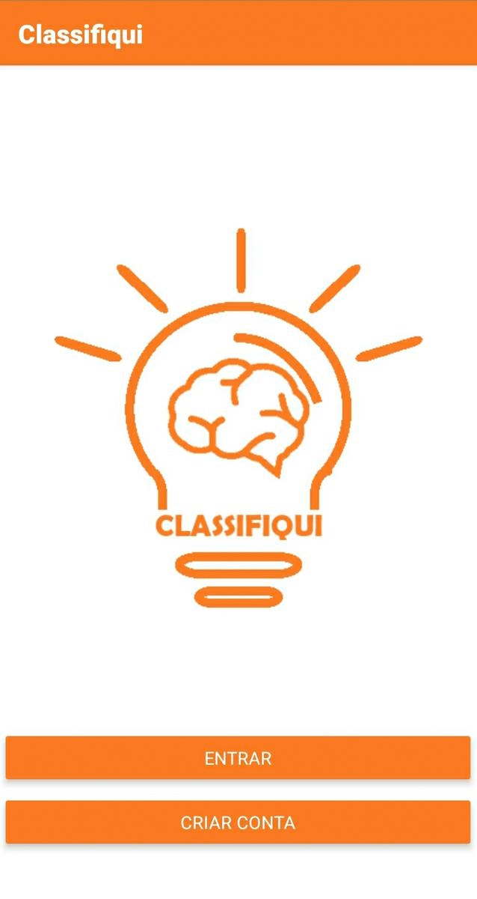

# Classifiqui

É um jogo educativo desenvolvido como Trabalho de Conclusão de Curso. O objetivo do jogo é a realização da classificação dos requisitos 
de um sistema, aplicando conhecimentos sobre as definições dos tipos de requisitos propostos por Wiegers. Para a realização do jogo um dos 
jogadores criará uma sala no jogo, e assim os demais participantes poderão entrar nessa sala.

O jogo trata-se de um jogo de cartas, digital desenvolvido utilizando o React Native, este será utilizado para o desenvolvimento do frontend e para o backend e armazenamento de dados será utilizado o firebase. Sendo assim o jogo utilizará de tecnologias digitais e das cartas como principal ferramenta de interação. lém do mais o jogo será desenvolvido apenas na versão mobile.
